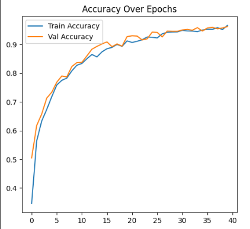
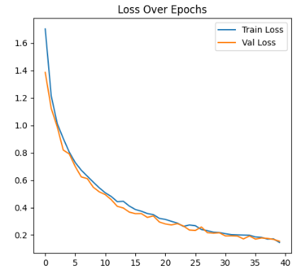
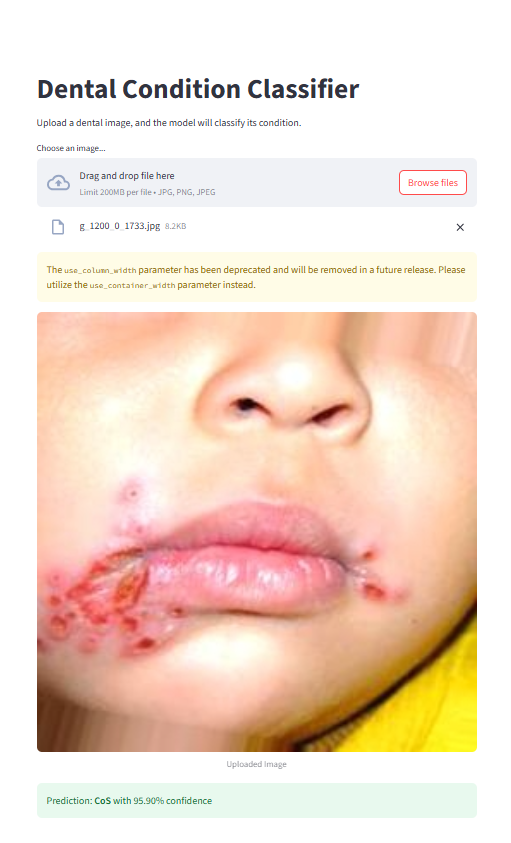

# 🦷 Teeth Condition Classification using Deep Learning

This project uses transfer learning (MobileNetV2) to classify dental images into categories such as `Gum`, `CaS`, `MC`, and others. The model is trained using TensorFlow/Keras and deployed with **Streamlit** for interactive real-time testing.

---

## 📊 Model Performance

| Metric       | Result       |
|--------------|--------------|
|Final Accuracy| ✅ 94%       |
| Model Type   | MobileNetV2  |
| Training Time | ~5–10 mins  |

---

## 🖼️ Visual Results

### ✅ Confusion Matrix  

---

### 📈 Training Accuracy & Loss  
  

---

### 🌐 Streamlit App Preview  

---

## 🧠 Features

- ✔️ Transfer Learning with MobileNetV2
- ✔️ Data Augmentation and Class Balancing
- ✔️ Confusion Matrix and Accuracy Evaluation
- ✔️ Streamlit Deployment
- ✔️ Color-coded prediction visualization (green = correct, red = wrong)

---

## 📦 Dependencies

Main libraries used:

tensorflow
streamlit
numpy
matplotlib
pillow
